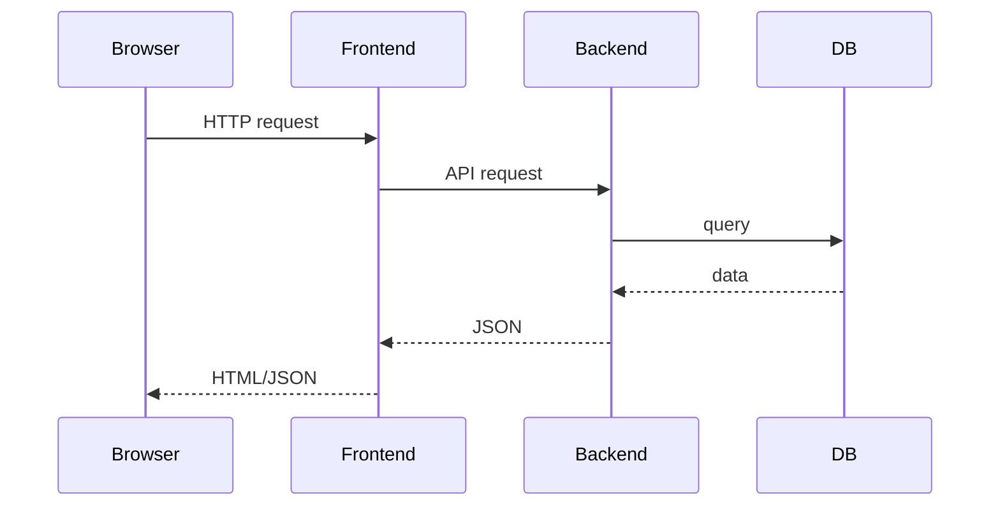

# Технический обзор

Документ описывает архитектуру **codexAIBlog**. Он предназначен для разработчиков и DevOps-инженеров, которым важно понимать структуру системы и взаимодействие её компонентов.

## Архитектура

Проект построен по классической headless-модели и состоит из двух сервисов:

- **Backend** — приложение Django 5, предоставляющее REST API.
- **Frontend** — приложение Next.js, обращающееся к API и рендерящее страницы через SSR и SSG.

Оба сервиса работают в Docker-контейнерах и общаются по HTTP. Основная база данных — PostgreSQL. Redis планируется для кэша и задач Celery.



### Компоненты

- **Django REST API** — эндпоинты для постов, тегов, рейтингов, коротких ссылок, аналитики и контактов. Для аутентификации используется JWT.
- **Next.js** — отображает интерфейс, получает данные из API во время сборки (SSG) или по запросу (SSR) и предоставляет CLI для разработки.
- **PostgreSQL** — хранит данные. Схема описана в `docs/DATABASE_SCHEMA.txt`.
- **Redis** — используется для кэширования и как брокер Celery (пока не реализован).
- **Docker и Compose** — локальная разработка и деплой ведутся через `infra/docker-compose.yml`.
- **CI/CD** — GitHub Actions собирает образы и может развёртывать их в Yandex Cloud.

### Модели данных

Основные модели определены в приложении `blog`:

- `User` — кастомная модель пользователя с уникальным email.
- `Post` — запись блога с заголовком, slug, описанием, JSON-телом, необязательным изображением и метаданными публикации.
- `Tag` — тег, связанный с постами отношением many-to-many.
- `Rating` — оценка поста (1–5 звёзд) с уникальным ограничением `(post, user_hash)`.
- `ShortLink` — короткая ссылка на пост.

Подробности можно найти в `docs/DATA_MODELS.txt` и `docs/DATA_MODELS_DETAIL.txt`.

### Безопасность и производительность

- Завершение HTTPS и HTTP/2 через Nginx (см. `docs/server.md`).
- JWT-токены для аутентификации.
- Контейнеризация позволяет горизонтально масштабировать сервисы. PostgreSQL и Redis развёрнуты отдельно, поэтому контейнеры приложения остаются stateless.
- Статические файлы обслуживаются `whitenoise` или Nginx. Next.js генерирует оптимизированные ассеты при сборке.

### Деплой

Рекомендуемый стек описан в `docs/server.md`: мониторинг Netdata, защита UFW/Fail2Ban, Gunicorn для Django и при необходимости Sentry. Образы строятся CI и могут быть развёрнуты в Yandex Cloud с помощью `docker-compose` или Kubernetes.

## Структура каталогов

```
backend/   # проект Django и приложения
frontend/  # приложение Next.js
infra/     # Docker и инфраструктурные конфиги
docs/      # документация
```

## Схема базы данных

ERD и SQL DDL находятся в `docs/DATABASE_SCHEMA.txt`. Модели также представлены в `docs/architecture.md` с помощью Mermaid.

## CI/CD

GitHub Actions запускает линтеры (`pre-commit`) и собирает Docker-образы. Для полноценного деплоя добавьте секреты Yandex Cloud, как указано в `docs/audit_recommendations.md`.
