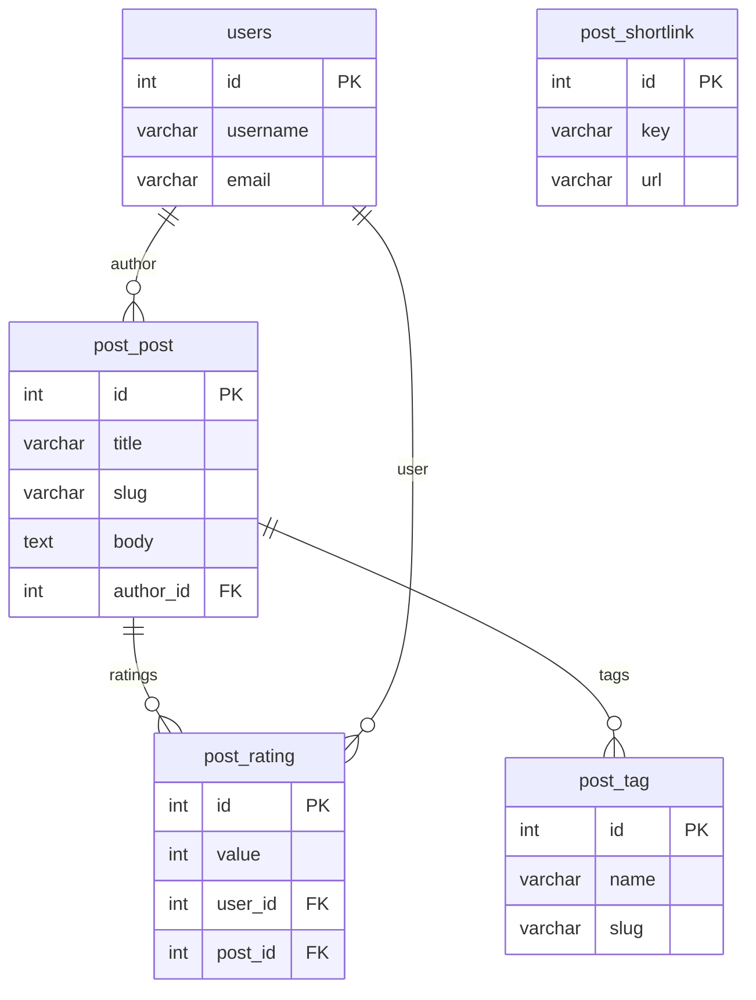

# Архитектура

Проект разделён на два основных сервиса: Django backend и Next.js frontend. Они разворачиваются в Docker‑контейнерах и взаимодействуют через REST API.

```
sequenceDiagram
  participant Browser
  participant Frontend
  participant Backend
  participant DB
  Browser->>Frontend: HTTP request
  Frontend->>Backend: API request
  Backend->>DB: query
  DB-->>Backend: data
  Backend-->>Frontend: JSON
  Frontend-->>Browser: HTML
```

База данных — PostgreSQL, кэш и брокер задач — Redis. Для фоновых задач используется Celery.

## ERD


